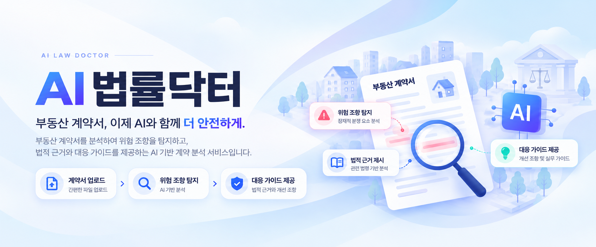
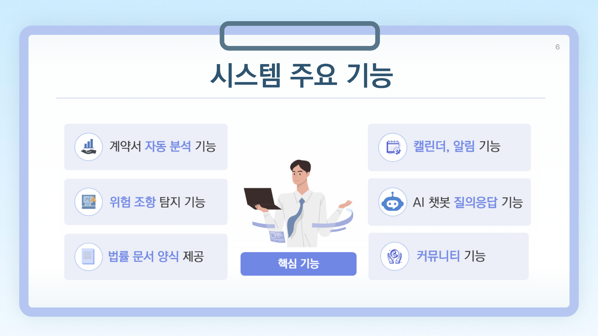
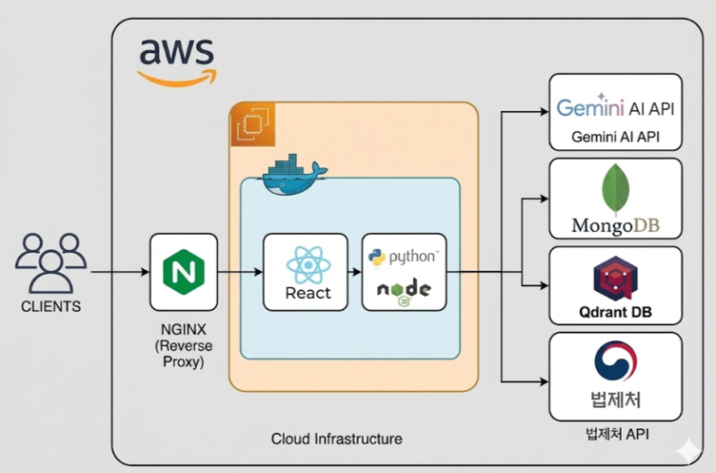
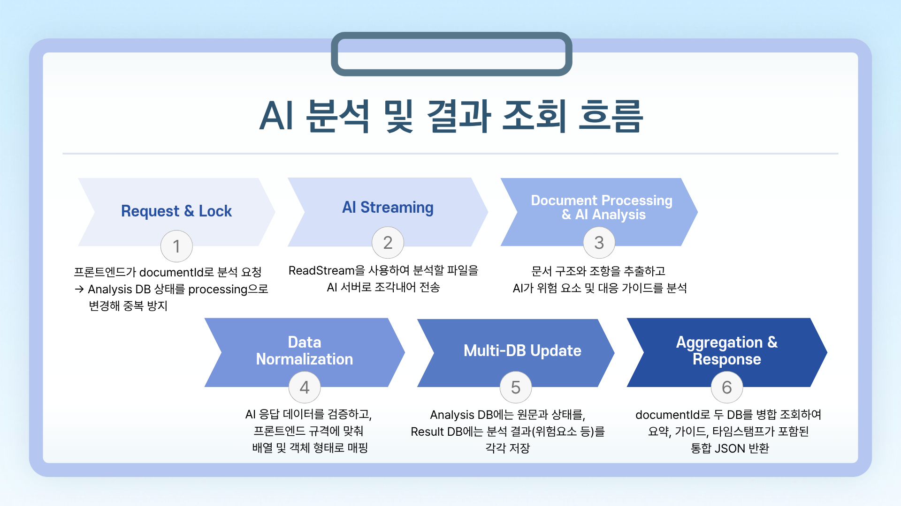
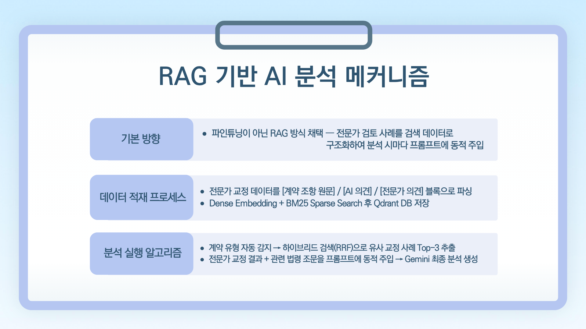
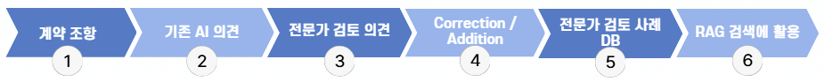

  

**AI 법률닥터**는 부동산 계약서를 분석하여 사용자가 놓치기 쉬운 위험 조항을 확인하고,
관련 법적 근거와 체크포인트, 대응 가이드 및 개선 조항을 제공하는 AI 기반 계약 분석 서비스입니다.

계약서 분석뿐만 아니라 AI 법률 챗봇, 커뮤니티, 마이페이지,
법률서식 및 일정관리 기능을 함께 제공하여 계약 전 검토부터 이후 관리까지 지원합니다.

## ▪️Key Features

  

AI 법률닥터는 계약서 분석을 중심으로 위험 조항 탐지, 법적 근거 및 대응 가이드 제공,
AI 법률 챗봇, 커뮤니티, 법률서식, 일정관리 등 계약 전후에 필요한 기능을 하나의 서비스로 제공합니다.

- **계약서 분석** — 계약서 핵심 내용 및 위험 요소 분석
- **위험 조항·대응 가이드** — 위험도, 판단 근거, 체크포인트 및 개선 조항 제공
- **AI 법률 챗봇** — 법률 용어·일반 법률 질문 및 서비스 이용 안내
- **개인정보 보호** — 계약서 내 개인정보 자동·수동 마스킹
- **커뮤니티·마이페이지** — 분석 결과 공유 및 계약서·사용자 활동 관리
- **법률서식·일정관리** — 관련 서식 조회 및 계약 후 일정 관리

 

## ▪️ Demo

AI 법률닥터의 주요 기능과 실제 서비스 흐름을 시연영상에서 확인할 수 있습니다.

https://github.com/user-attachments/assets/c1d62c44-b35f-4920-b976-37fd83bb593b

## ▪️Tech Stack

### Frontend

  

### Backend

 
 

### AI

   

### Infra

 

### Collaboration

 

## ▪️System Architecture

## ▪️Team

| 한민엽 | 하승훈 | 권도연 | 이서윤 | 전지우 |
| :---: | :---: | :---: | :---: | :---: |
| AI | AI | Backend | Backend | Frontend |

 

 

## ▪️Key Technologies

- **RAG** — Dense Search + BM25 + RRF

- **문서 처리** — hwp5html + BeautifulSoup + OCR

- **인증** — JWT + Google OAuth + Kakao OAuth

- **외부 서비스 연동** — Google Calendar API 

 
 

## ▪️ AI 분석 흐름

사용자가 업로드한 계약서는 문서 형식에 맞게 변환 및 정제한 뒤,
계약서의 주요 내용과 조항을 추출하여 AI 분석에 활용합니다.

분석 과정에서는 계약 유형을 확인하고 관련 법령 및 전문가 검토 사례를 검색한 후,
검색 결과를 분석 Context에 반영하여 요약, 위험 조항, 판단 근거, 대응 가이드 및 개선 조항을 생성합니다.

  

> 계약서 업로드부터 문서 처리, AI 분석, 결과 저장 및 조회까지 하나의 흐름으로 연결하여
> 사용자에게 구조화된 계약 분석 결과를 제공합니다.

 

## ▪️ RAG 기반 AI 분석

AI 법률닥터는 계약서 원문만을 생성형 AI에 전달하는 방식에서 벗어나,
**관련 법령과 전문가 검토 사례를 함께 검색하여 분석 근거를 보완하는 RAG 구조**를 적용했습니다.

계약 유형을 먼저 확인한 뒤 의미 기반 Dense Search와 BM25 기반 Sparse Search를 함께 수행하고,
검색 결과를 RRF 방식으로 재정렬하여 관련성이 높은 법령 및 전문가 사례를 Gemini 분석 Context에 반영합니다.

  

### 핵심 구성

- **계약 유형 분류** — 계약 유형을 구분하여 관련 전문가 사례 검색 범위를 조정합니다.
- **Dense Search** — 의미적으로 유사한 법령과 전문가 검토 사례를 검색합니다.
- **BM25** — 법률 용어 및 핵심 키워드를 기준으로 관련 정보를 검색합니다.
- **RRF Re-ranking** — Dense Search와 BM25 결과를 결합하여 관련도가 높은 순서로 재정렬합니다.
- **Qdrant** — 법령 및 전문가 검토 사례 검색을 위한 Vector 데이터를 관리합니다.
- **Gemini 2.5 Flash** — 계약서와 검색 Context를 바탕으로 최종 분석 결과를 생성합니다.

> 전문가 검토 데이터의 세부 구성과 `Correction / Addition` 분류 방식,
> RAG 적용 전후 평가 결과는 다음 절에서 별도로 설명합니다.

 

## ▪️ 전문가 검토 데이터 활용

AI 법률닥터는 관련 법령과 전문가 검토 사례를 검색하여
계약서 분석의 근거를 보완하도록 구성했습니다.

전문가 검토 데이터는 다음과 같은 형태로 재구성하여
RAG 검색 데이터로 활용했습니다.

* **Correction:** 기존 AI 분석 내용을 수정하거나 보완한 사례
* **Addition:** 기존 AI 분석에서 누락된 내용을 전문가가 추가한 사례

이렇게 구축된 사례는 관련 법령 데이터와 함께 검색되어
Gemini 분석 Context에 반영됩니다.

 

## ▪️RAG 적용 결과

전문가 검토 의견을 기준으로 RAG 적용 전후 AI 분석 결과의 반영 수준을 평가했습니다.

| 평가 지표 | 결과 |
| :--- | :---: |
| RAG 전문가 교정 데이터 | **30개** |
| 전문가 교정 의견 반영 평가 | **7개 중 5개 반영** |
| RAG 적용 후 전문가 의견 반영률 | **71.4%** |
| 대표 사례 RAG 적용 전 반영률 | **50.0%** |
| 대표 사례 RAG 적용 후 반영률 | **90.0%** |
| 대표 사례 향상 폭 | **+40.0%p** |

전문가 교정 의견 **7개를 대상으로 AI 분석 결과의 반영 여부를 평가한 결과, 5개가 반영되어 RAG 적용 후 71.4%의 전문가 의견 반영률을 확인했습니다.**

### 대표 사례 분석

대표 사례인 **원룸 파손책임 계약서의 중개보수 조항**을 대상으로
위험 조항 탐지, 위험도 판단, 법적 근거, 실무 대응, 개선안의 반영 수준을 비교했습니다.

| 평가 항목 | RAG 적용 전 | RAG 적용 후 |
| :--- | :--- | :--- |
| 위험 조항 탐지 | 중개보수 초과 가능성 탐지 | **동일 조항을 위험 항목으로 탐지** |
| 위험도 판단 | 과도한 중개보수 가능성 설명 | **HIGH 위험으로 분류** |
| 법적 근거 | 법정 요율 초과 중심 | **법정 요율, 초과 금액, 부가세 문제 설명** |
| 실무 대응 | 일반적인 주의 수준 | **요율 확인, 거부 및 신고 방법 제시** |
| 개선안 | 제한적 | **법정 요율 기준 수정 조항 제시** |

대표 사례의 평가 항목 반영률은 **50.0%에서 90.0%로 향상(+40.0%p)**되었습니다.

> 해당 수치는 법률 판단의 절대 정확도가 아니라,
> 전문가 검토 의견이 AI 분석 결과에 어느 정도 반영되었는지를 비교한
> 프로젝트 내부 평가 결과입니다.

 

## ▪️Ground Rules

- 정기 회의를 통해 파트별 진행 상황과 이슈를 공유합니다.
- API 및 DB 구조 변경 사항은 관련 담당자에게 공유합니다.
- GitHub를 기반으로 소스코드와 변경 사항을 관리합니다.
- 기능 구현 후 파트별 테스트와 통합 테스트를 진행합니다.
- 주요 오류는 관련 파트 담당자가 함께 원인을 확인합니다.
