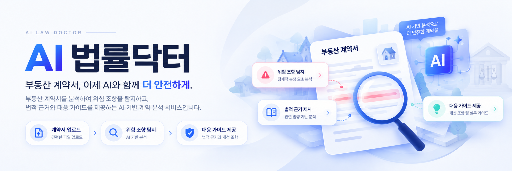

  

**AI 법률닥터**는 부동산 계약서를 분석하여 사용자가 놓치기 쉬운 위험 조항을 확인하고,
관련 법적 근거와 체크포인트, 대응 가이드 및 개선 조항을 제공하는 AI 기반 계약 분석 서비스입니다.

계약서 분석뿐만 아니라 AI 법률 챗봇, 커뮤니티, 마이페이지,
법률서식 및 일정관리 기능을 함께 제공하여 계약 전 검토부터 이후 관리까지 지원합니다.

## ▪️Key Features

  

AI 법률닥터는 계약서 분석을 중심으로 위험 조항 탐지, 법적 근거 및 대응 가이드 제공,
AI 법률 챗봇, 커뮤니티, 법률서식, 일정관리 등 계약 전후에 필요한 기능을 하나의 서비스로 제공합니다.

- **계약서 분석** — 계약서 핵심 내용 및 위험 요소 분석
- **위험 조항·대응 가이드** — 위험도, 판단 근거, 체크포인트 및 개선 조항 제공
- **AI 법률 챗봇** — 법률 용어·일반 법률 질문 및 서비스 이용 안내
- **개인정보 보호** — 계약서 내 개인정보 자동·수동 마스킹
- **커뮤니티·마이페이지** — 분석 결과 공유 및 계약서·사용자 활동 관리
- **법률서식·일정관리** — 관련 서식 조회 및 계약 후 일정 관리

 

## ▪️ Demo

AI 법률닥터의 주요 기능과 실제 서비스 흐름을 시연영상에서 확인할 수 있습니다.

### 🌐 Service
[AI 법률닥터 바로가기](https://aidoc.kro.kr)

### ▶️ Demo Video
https://github.com/user-attachments/assets/c1d62c44-b35f-4920-b976-37fd83bb593b

 

## ▪️ AI 분석 흐름

사용자가 업로드한 계약서는 문서 형식에 맞게 변환 및 정제한 뒤,
계약서의 주요 내용과 조항을 추출하여 AI 분석에 활용합니다.

분석 과정에서는 계약 유형을 확인하고 관련 법령 및 전문가 검토 사례를 검색한 후,
검색 결과를 분석 Context에 반영하여 요약, 위험 조항, 판단 근거, 대응 가이드 및 개선 조항을 생성합니다.

  

> 계약서 업로드부터 문서 처리, AI 분석, 결과 저장 및 조회까지 하나의 흐름으로 연결하여
> 사용자에게 구조화된 계약 분석 결과를 제공합니다.

 

## ▪️ RAG 기반 AI 분석

AI 법률닥터는 계약서 원문만을 생성형 AI에 전달하는 방식에서 벗어나,
**관련 법령과 전문가 검토 사례를 함께 검색하여 분석 근거를 보완하는 RAG 구조**를 적용했습니다.

계약 유형을 먼저 확인한 뒤 의미 기반 Dense Search와 BM25 기반 Sparse Search를 함께 수행하고,
검색 결과를 RRF 방식으로 재정렬하여 관련성이 높은 법령 및 전문가 사례를 Gemini 분석 Context에 반영합니다.

  

### 핵심 구성

- **계약 유형 분류** — 계약 유형을 구분하여 관련 전문가 사례 검색 범위를 조정합니다.
- **Dense Search** — 의미적으로 유사한 법령과 전문가 검토 사례를 검색합니다.
- **BM25** — 법률 용어 및 핵심 키워드를 기준으로 관련 정보를 검색합니다.
- **RRF Re-ranking** — Dense Search와 BM25 결과를 결합하여 관련도가 높은 순서로 재정렬합니다.
- **Qdrant** — 법령 및 전문가 검토 사례 검색을 위한 Vector 데이터를 관리합니다.
- **Gemini 2.5 Flash** — 계약서와 검색 Context를 바탕으로 최종 분석 결과를 생성합니다.

> 전문가 검토 데이터의 세부 구성과 `Correction / Addition` 분류 방식,
> RAG 적용 전후 평가 결과는 다음 절에서 별도로 설명합니다.
