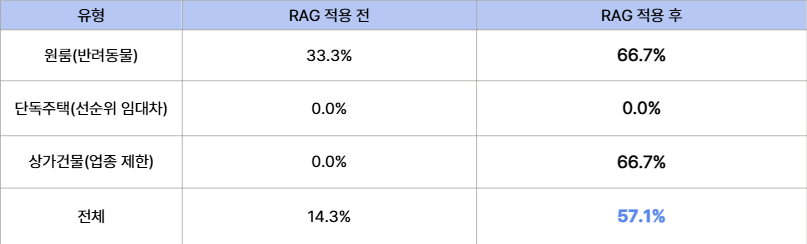
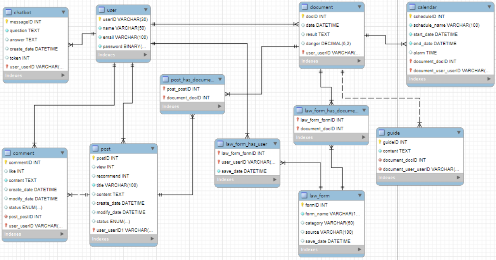
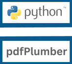

# 전문가 검토 데이터 활용 구조
## 1. 개요
'AI 법률 닥터' 시스템은 일반 사용자가 업로드한 계약서의 독소조항 및 법적 리스크를 정확하게 판별하기 위해, 실제 법률 전문가의 검토 데이터와 공신력 있는 법령·판례 데이터를 RAG 구조로 연동하여 분석의 정확도를 높입니다.

## 2. 데이터 구성 요소
* **법률 및 판례 데이터**: 주택임대차보호법, 상가건물임대차보호법 및 관련 주요 분쟁 판례
* **전문가 검토 사례**: 실제 공인중개사 및 법률 전문가가 검증한 특약사항 예시, 위험 조항 교정 사례, 독소조항 패턴 DB
* **사용자 계약서 입력**: 사용자가 업로드한 HWP/HWPX, PDF 등 임대차 계약서 텍스트

## 3. 데이터 활용 및 처리 파이프라인 (RAG 구조)

[사용자 계약서 업로드]

↓

[텍스트 파싱 및 개인정보 마스킹]

↓

[Qdrant 벡터 DB: 법령/전문가 검토 사례 유사도 검색] → [유사한 전문가 교정 패턴 및 법적 근거 추출]

↓

(Context 주입)

↓

[Gemini 2.5 Flash 분석 엔진]

↓

[리스트 평가 및 전문가 관점의 가이드 생성]

 

1. **텍스트 전처리 및 마스킹**: 계약서 내 민감한 개인정보(주민등록번호, 연락처 등)를 정규식 및 수동 마스킹으로 보호합니다.
2. **벡터화 및 검색**: 입력된 계약서 조항과 유사한 전문가 검토 이력 및 법령 데이터를 고속으로 검색합니다.
3. **LLM 추론 및 교정**: 검색된 전문가 검토 패턴을 컨텍스트로 함께 주입하여, Gemini 모델이 단순 요약을 넘어 전문가 관점의 리스크(HIGH/MEDIUM/LOW) 판정 및 대안 조항을 도출하도록 유도합니다.

## 4. 기대 효과
* **환각 현상(Hallucination) 최소화**: 검증된 법률 데이터와 전문가 패턴을 기반으로 답변을 생성하여 분석 신뢰도를 확보합니다.
* **심효성 있는 대안 제시**: 단순 조항 해석에 그치지 않고, 전문가가 실제로 사용하는 교정 가이드라인을 사용자에게 제공합니다.

 
 

# RAG 적용 결과

 
 

# 시스템 아키텍처

## CI/CD 파이프라인

## ERD

 
 

# 기술 스택

**Frontend**

  

**backend**

  

**AI 분석**

    

**RAG**

  

**DB**

 

**기타 도구**

  

 
 

# 업무 분담

| 한민엽 | 하승훈 | 권도연 | 이서윤 | 전지우 |
| :---: | :---: | :---: | :---: | :---: |
| AI | AI | Backend | Backend | Frontend |

 
 

# 그라운드 룰

## 1. 소통 및 연락 규칙

* **응답 및 피드백 시간**: 업무 시간 내 메시지 확인 시 2시간 이내로 간단한 확인 반응 남기기
* **주요 소통 채널**: 카카오톡 공지 확인 철저, 중요 안건은 반드시 텍스트로 기록 남기기
* **일정 변경 공유**: 개인 사정이나 일정 지연 발생 시, 마감기한 최소 24시간 전에 미리 공유하기

## 2. 회의 및 협업 규칙

* **정기 회의**: 매주 수요일에 진행하며, 지각 시 사소한 간식 벌칙(또는 상호 존중) 적용
* **회의록 작성**: 회의 시 나온 결정 사항과 액션 아이템은 당일 내로 정리해서 노션에 공유하기
* **상호 존중**: 의견을 조율할 때는 비판보다는 대안을 먼저 제시하고, 감정적인 마찰 없이 건설적으로 토론하기

## 3. 코드 관리 및 개발 규칙 (Git / Version Contrl)

* **브랜치 전략**: main 브랜치는 항상 배포 가능한 상태로 유지하고, 기능 개발은 반드시 개별 브랜치(feature/기능이름)에서 작업 후 PR(Pull Request)을 거쳐 병합하기
* **커밋 메시지 컨벤션**: 명확한 이력을 위해 커밋 메시지는 통일된 형식으로 작성하기 (예: feat: 로그인 화면 구현, fix: API 응답 에러 수정)
* **코드 리뷰**: PR 요청 시 팀장의 확인을 거친 뒤 머지(Merge) 진행하기

## 4. 무임승차 방지 규칙

* 맡은 역할과 세부 업무는 기한 내에 책임지고 완수하기
* 개인 사정으로 작업이 어려울 경우 팀원에게 미리 알려 업무를 분담하거나 도움 요청하기